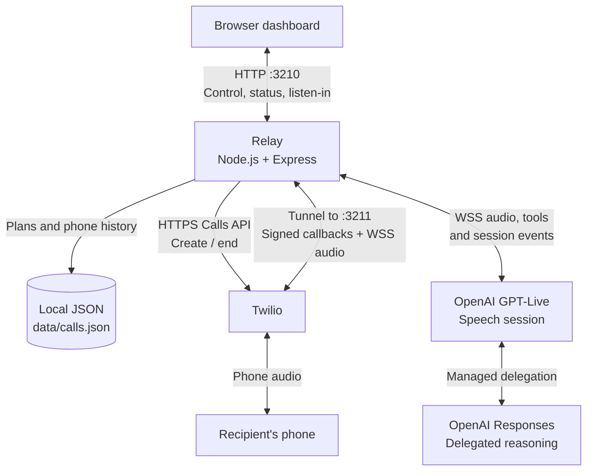
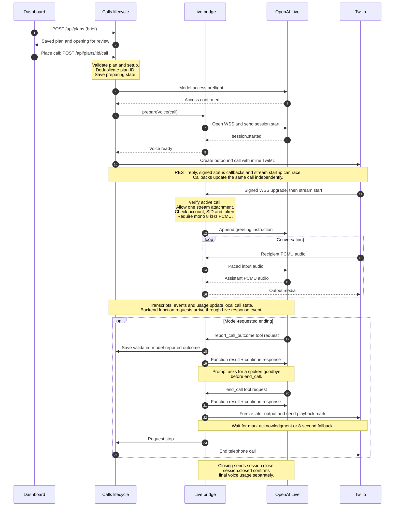

# Relay architecture

Relay is one local Node.js process with two HTTP listeners. It owns call approval, phone-call lifecycle, and the audio bridge; Twilio owns the telephone connection, and OpenAI owns speech and delegated reasoning.

This describes the implementation on `main` at `5d655fe` (reviewed 2026-09-26). Feature-branch proposals are outside this snapshot. The diagrams are maintained as Mermaid source in this file; the source map below is the starting point for updating them.

## System overview

This is a runtime architecture view, not a class hierarchy. Arrows name the traffic or responsibility. The phone path is shown here; browser voice testing takes a different audio path, described below.

Both listeners bind to `127.0.0.1`. The diagram uses the default ports, configurable through `PORT` and `WEBHOOK_PORT`. Only the callback listener on **3211** goes through the public HTTPS/WSS tunnel. The dashboard on **3210** checks local host/origin and serves the UI and control API; the callback listener exposes signed Twilio status and media routes. They share the same process and call state.

Responses delegation is configured by `buildSession()` and runs inside the OpenAI integration. Relay receives backend tool requests through the Live connection and returns their results on that connection. It does not run a separate reasoning worker or issue its own Responses HTTP requests.

## Phone-call sequence

The key ordering is **review → explicit call request → voice ready → dial → authenticate stream → conversation**. Saving a brief does not create a voice session or dial. HTTP routing and persistence callbacks are folded into their owning modules to keep the sequence readable.

The signature check happens in `server.js` before WebSocket attachment; the stream identity and codec checks happen in `live-bridge.js`. The first greeting, transcripts, audio, and call tools wait for the authenticated stream. Twilio receives `<Connect><Stream>` and a trailing `<Hangup>` directly in the create-call request; there is no separate TwiML-serving endpoint.

The ending block shows the intended model workflow. Reporting an outcome and saying goodbye before `end_call` are prompt instructions; the bridge does not verify that goodbye was spoken or require a previous outcome report before accepting `end_call`. Its deterministic barrier covers audio already queued to Twilio, with an eight-second fallback that leaves playback unconfirmed. User stop, remote hangup, failure, and duration limits can end the call without this block.

## Three distinct browser experiences

| Mode | Audio path | Control and tool ownership | Retained state |
| --- | --- | --- | --- |
| Phone call | Recipient ↔ Twilio ↔ Relay bridge ↔ OpenAI Live; 8 kHz PCMU | `Calls` owns start/stop; the bridge handles backend tools | Plans, transcript, events, outcome and usage in `data/calls.json` |
| Listen to phone call | Bridge copies recipient input and submitted assistant output → local SSE → browser playback | `CallMonitor` is a receive-only observer; Listen never opens the microphone | No audio recording or replay; joining starts with new frames |
| Browser voice test | Browser microphone/playback ↔ OpenAI Live directly over WebRTC; codec negotiated by WebRTC | `LocalTests` creates the session and maintains a control WebSocket; browser code owns greeting, captions and tool handling | Transcript and outcome remain in the test page; no phone-history write |

Browser testing reuses `brief.js` for the voice, instructions and tool definitions, but bypasses Twilio and `live-bridge.js`. The browser submits its SDP offer and brief to `/api/local-test/session`; Relay uses the server-held API key to create the session and returns the SDP answer. Audio stays on WebRTC. The server's attached WebSocket watches lifecycle/final usage and can close an abandoned test when heartbeats expire. A phone call and a browser test cannot run concurrently.

Listen-in is attached to the phone path as optional observation. Slow or broken listeners are disconnected without blocking the telephone stream. The assistant track reflects audio submitted to Twilio, not proof of the recipient's exact playback timing.

## Source map

| File | Responsibility |
| --- | --- |
| [`src/server.js`](../src/server.js) | Composition root; two listeners; local API; signed callbacks/upgrades; wiring bridge events into call state |
| [`src/calls.js`](../src/calls.js) | Plan snapshots, duplicate-call prevention, prepare-before-dial, duration limits, stop, status reconciliation and restart recovery |
| [`src/brief.js`](../src/brief.js) | Brief/outcome schemas, opening line, Live instructions and Responses delegation/tool configuration |
| [`src/live-bridge.js`](../src/live-bridge.js) | Prepared Live session, authenticated phone attachment, paced PCMU audio, transcripts, tool deduplication, playback drain and final usage |
| [`src/provider.js`](../src/provider.js) | Twilio create/end calls, inline stream TwiML and OpenAI model-access preflight |
| [`src/store.js`](../src/store.js) | In-memory plans/calls backed by JSON; terminal statuses; redacted public call shape |
| [`src/local-test.js`](../src/local-test.js) | WebRTC session creation, server control attachment, heartbeat lease and close/usage confirmation |
| [`src/call-monitor.js`](../src/call-monitor.js) | Bounded live-audio SSE fan-out with no recording or replay |
| [`src/config.js`](../src/config.js), [`src/settings.js`](../src/settings.js) | Runtime configuration, setup status and local settings persistence |
| [`public/app.js`](../public/app.js), [`public/call-monitor.js`](../public/call-monitor.js) | Brief/review/call UI, status polling and explicit receive-only playback |
| [`public/local-test.js`](../public/local-test.js), [`public/local-test-protocol.js`](../public/local-test-protocol.js) | Browser WebRTC, greeting, captions, tool results, session cleanup and transport diagnostics |

## Invariants worth preserving

- **Approval is an explicit action.** Only the call endpoint starts the phone workflow. One saved plan maps to at most one call; a deliberate second attempt needs a newly reviewed plan.
- **Prepare before dialing.** Voice readiness precedes the Twilio create request. Cancellation/failure checks between stages prevent later dialing after a stopped preparation.
- **Uncertain delivery stays unresolved.** A create-call timeout is not evidence that no phone call exists. New calls remain blocked while that call is active; no automatic redial occurs.
- **Restart recovery requests stop.** Both listeners are acquired before recovery. Persisted preparations are canceled; other unfinished calls are stopped when identifiable, with uncertainty retained if hangup cannot be confirmed.
- **Transport, outcome and usage are separate.** `completed` means the phone transport ended. Outcomes are model-reported; missing outcomes fall back to `needs-user`. Final voice usage requires `session.closed`, not just a disconnected phone.
- **Phone audio is transient.** Stored phone history excludes audio recordings. Monitor failures must never interrupt the call.

The implementation evidence lives in [`test/server.test.js`](../test/server.test.js), [`test/calls.test.js`](../test/calls.test.js), [`test/live-bridge.test.js`](../test/live-bridge.test.js), [`test/phone-stream.test.js`](../test/phone-stream.test.js), the [`call-monitor integration tests`](../test/call-monitor-integration.test.js), and [`test/local-test.test.js`](../test/local-test.test.js). These simulate providers and sockets; they do not prove subjective audio quality or a real call's outcome.

## Maintaining these diagrams

Update this file when a change moves a responsibility, adds a transport or persistence boundary, changes approval/start/stop ordering, or introduces a new browser audio path. Keep feature proposals in separate design documents until implemented. Review the Mermaid rendering as well as the source; the prose and source map are the text alternative for narrow screens or Markdown viewers without Mermaid support.
